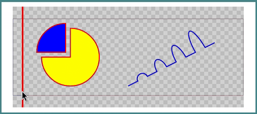

<h1 align="center">
  <a href="https://github.com/adamws/lukaj"></a>
</h1>
<h4 align="center">

  Interactive diff tool for SVG images.

  [](https://crates.io/crates/lukaj)
  [](https://github.com/adamws/lukaj/actions/workflows/build-and-test.yml)
  [](https://github.com/adamws/lukaj/blob/master/LICENSE)
  [](https://coveralls.io/github/adamws/lukaj?branch=master)
</h4>

## Features

Swipe SVG graphics comparison with zoom and drag support.

<p align="center">
  
</p>

## Installation

To install **precompiled** version of lukaj go to [latest release](https://github.com/adamws/lukaj/releases/latest)
page and download archive for your system. Provided binaries are
static executables for Windows and Linux.

If you're a Rust programmer, lukaj can be installed with `cargo`.
It supports two graphics backends which are enabled/disabled with
[cargo features](https://doc.rust-lang.org/cargo/reference/features.html).
The `use-rsvg` feature is available only when installing from source, precompiled binaries
on release page include only default feature set.

| Feature name         | SVG library                                 | 2D rendering library                                 | Precompiled binary release |
| ---                  | ---                                         | ---                                                  | ---                        |
| `use-usvg` (default) | [resvg](https://crates.io/crates/resvg)     | [tiny-skia](https://github.com/RazrFalcon/tiny-skia) | yes                        |
| `use-rsvg`           | [librsvg](https://crates.io/crates/librsvg) | [cairo](https://www.cairographics.org/)              | no                         |

Depending on the operating system and selected feature set, lukaj will require
additional development libraries.

<details>
  <summary>On <b>Ubuntu Linux</b> <i>(click to expand)</i></summary>

  1. When using only default `use-usvg` feature:

      ```bash
      $ sudo apt-get install libsdl2-dev
      $ cargo install lukaj
      ```

  2. When using additional `use-rsvg` feature:

      ```bash
      $ sudo apt-get install build-essential libcairo2-dev libgdk-pixbuf-2.0-dev \
          libglib2.0-dev libpango1.0-dev libsdl2-dev libxml2-dev
      $ cargo install lukaj --feature user-rsvg
      ```

</details>

<details>
  <summary>On <b>Windows</b> (using <a href="https://www.msys2.org/">MSYS2</a>) <i>(click to expand)</i></summary>

  1. Install MSYS2 and run from it's terminal run:
      - For default `use-usvg` feature:

        ```bash
        $ pacman -S mingw-w64-x86_64-SDL2
        ```

      - For additional `use-rsvg` feature:

        ```bash
        $ pacman -S mingw-w64-x86_64-gtk4 mingw-w64-x86_64-gettext \
            mingw-w64-x86_64-libxml2 mingw-w64-x86_64-pkgconf \
            mingw-w64-x86_64-gcc mingw-w64-x86_64-SDL2
        ```

  2. Add mingw binaries path (`C:\msys64\mingw64\bin`) to system `Path`
  3. Change default rust toolchain to `stable-gnu`

      ```bash
      rustup toolchain install stable-gnu
      rustup default stable-gnu
      ```

  4. Run cargo install command

      - For default feature only:

        ```bash
        $ cargo install lukaj
        ```

      - For additional `use-rsvg` feature:

        ```bash
        $ cargo install lukaj --features use-rsvg
        ```

  For different setups see this [GUI development with Rust and GTK4](https://gtk-rs.org/gtk4-rs/stable/latest/book/installation_windows.html) guide.

</details>

## Usage

To compare two SVG files run:

```
$ lukaj [path 1] [path 2]
```

Lukaj uses following mouse/keyboard controls:

| Button            | Action                        |
| ---               | ---                           |
| Left Click        | Move diff separator           |
| Right Click       | Move images                   |
| Scroll            | Zoom in and out               |
| R                 | Reset images position         |
| Esc               | Exit                          |

<details>
  <summary>Complete lukaj options <i>(click to expand)</i></summary>

  ```
  $ lukaj --help
  Interactive diff tool for SVG images

  Usage: lukaj [OPTIONS] [FILES]...

  Arguments:
    [FILES]...  Files to compare

    Options:
      -s, --scale <VALUE>      Sets a scaling factor
      --backend <BACKEND>      Preferred backend [default: rsvg-with-cairo]
                               [possible values: rsvg-with-cairo, usvg-with-skia]
      -h, --help               Print help
      -V, --version            Print version
  ```

</details>

### Git integration

Lukaj can be used as [git difftool](https://git-scm.com/docs/git-difftool).
To add `git diff-svg` custom command, copy and paste following sections to `.gitconfig` file:

```
[difftool "lukaj"]
    cmd = ~/.cargo/bin/lukaj $LOCAL $REMOTE
[alias]
    diff-svg = "difftool -t lukaj -y"
```

### Other integrations

- [PCB visual diff with kicad-cli and lukaj](https://adamws.github.io/pcb-visual-diff-with-kicad-cli-and-lukaj)
